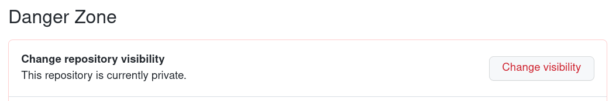

# Numerical Computing Community Software Analysis

[Accept this assignment](https://classroom.github.com/a/LrudzhO7)

For this assignment, you will identify an open source software package of
relevance to numerical computing and investigate how its development process
works. This should be a project with an active developer community from multiple
institutions that discuss their rationale in public, such as a mailing list
and/or GitHub/GitLab issues and pull requests. You will write and present about
the performance and capability needs of key stakeholders, the way project
resources are allocated, their metrics for comparison, and the way topics from
class (such as stability and conditioning) relate to the software.

## How to find interesting software

### GitHub Code Search
I highly recommend using [GitHub code search](https://github.com/search); type a
phrase or relevant keywords in and see what packages show up. GitLab explore is
also useful. Flip through a few repositories to find one that seems high-quality
and relevant (and in a language you can grok). Please attempt to find a project
that

1. has automated testing (look for a badge that says "build passing", recent runs under GitHub's "Actions" tab, GitLab "CI/CD Pipelines", or similar)
2. has at least 5 committers and/or at least 10 stars
3. has commits within the past two months

These criteria are meant to encourage you to find higher quality software with
healthy communities. If you find a package that seems to be high quality but
doesn't satisfy these criteria, that is okay. This project is supposed to be
fun and I'm just looking for you to make a serious attempt. Please focus your
effort on what you find interesting, not on trying to check every box in a
rubric.

### Software Journals

Some journals publish peer-reviewed software. Try searching for keywords in one of these journals:
* [Journal of Open Source Software](https://joss.theoj.org/papers/)
* [Geoscientific Model Development](https://gmd.copernicus.org/)

## What to look for?

* What key problems are solved?
  * Rootfinding? Interpolation? Regression?
  * Is it general-purpose software or domain-specific? What makes it unique?
* Who are the stakeholders?
  * Who develops the software, who uses it, who pays for it?
  * What are they looking for?
  * How do they communicate and collaborate?
  * Who uses the software?
  * Who is impacted (positively or negatively) by use of the software?
* Metrics and features
  * How do concepts like accuracy, conditioning, stability, and cost appear?
  * If the software is fast, how is "fast" defined?
  * If the software is accurate, what does accuracy mean? Could you make a plot, say accuracy vs cost? How would you label the axes to make it relevant to a stakeholder?
  * Would different stakeholders want different axes (because they care about different things)?
  * Are there modeling decisions made in the interest of good conditioning? Are there algorithmic choices made for stability?

## Download and run an example

* Download the software. If it needs compilation, install any needed tools and follow the build instructions. If you're pretty sure you've followed the directions, but still have problems, f
ile an issue with the project (check their docs to see how they prefer).
* Pick a tutorial and example that uses the software and run it. Pick something to change (could be printing a diagnostic or changing the problem size).

## Create a presentation

1. Create a notebook or other presentation in this repository (could be a PDF, video, etc.). You'll make this public (circa April 4) to share with peers. If you make a video or presentation
that you wish to host elsewhere, please create a markdown file with a brief title and abstract, and link to the external presentation.
2. Try to convey what you've learned about the project in what would take 5-10 minutes to read/watch. If it's software that can run in a notebook, you can include runnable examples. Images a
nd plots are highly encouraged.
3. Share at least one question you have about the software.
4. Propose at least one experiment that would be interesting for a group project. Describe what the experiment would measure and how it would be presented (e.g., what the axes would be on a
figure).
5. Commit and push to your repository.
6. Make your repository public on GitHub by clicking "Settings", scroll to the bottom and "Change visibility".

7. Start a thread on Zulip titled "Your Name: Package Name" with a sentence or two describing the project and a link to your repository.

## Timeline

* March 24: Edit `proposal.md` with basic stats, commit, and push.
* April 4: Announce your project on Zulip
* April 5-7: Share among groups in class
* April 10: Form groups to start group projects
